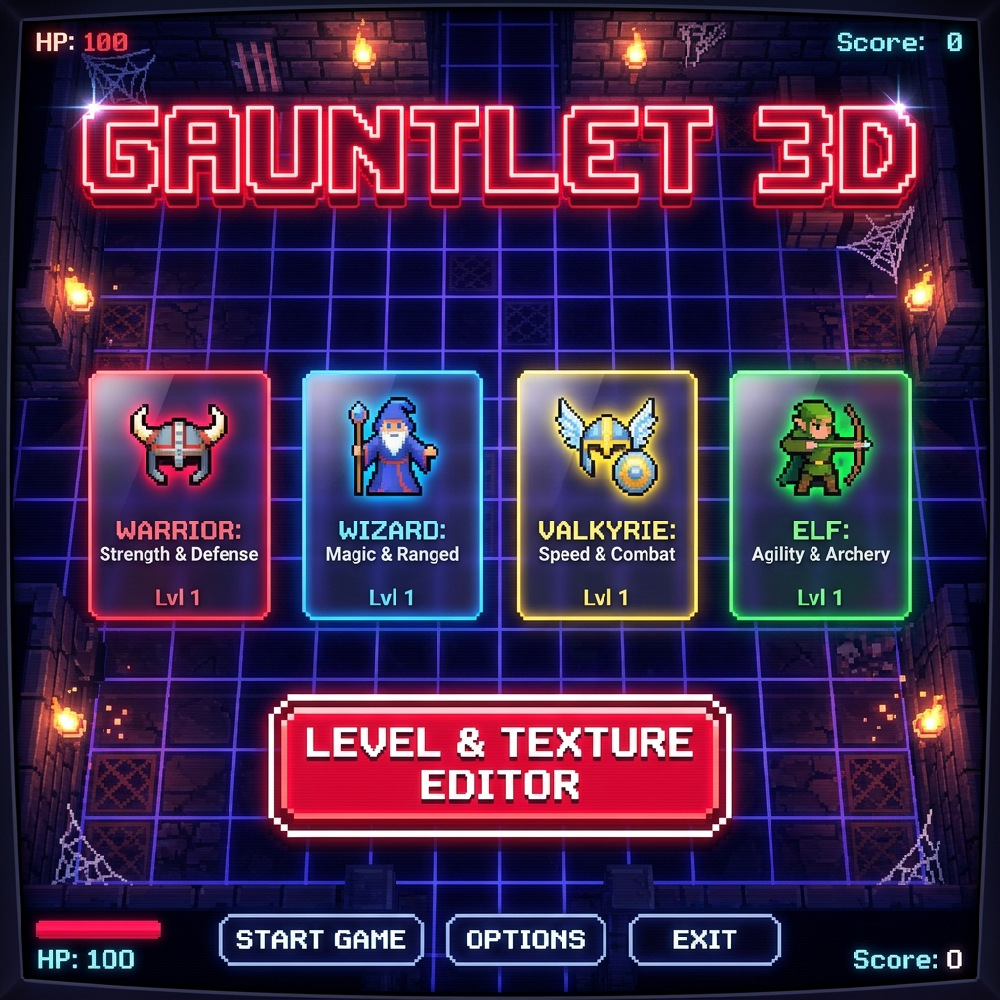
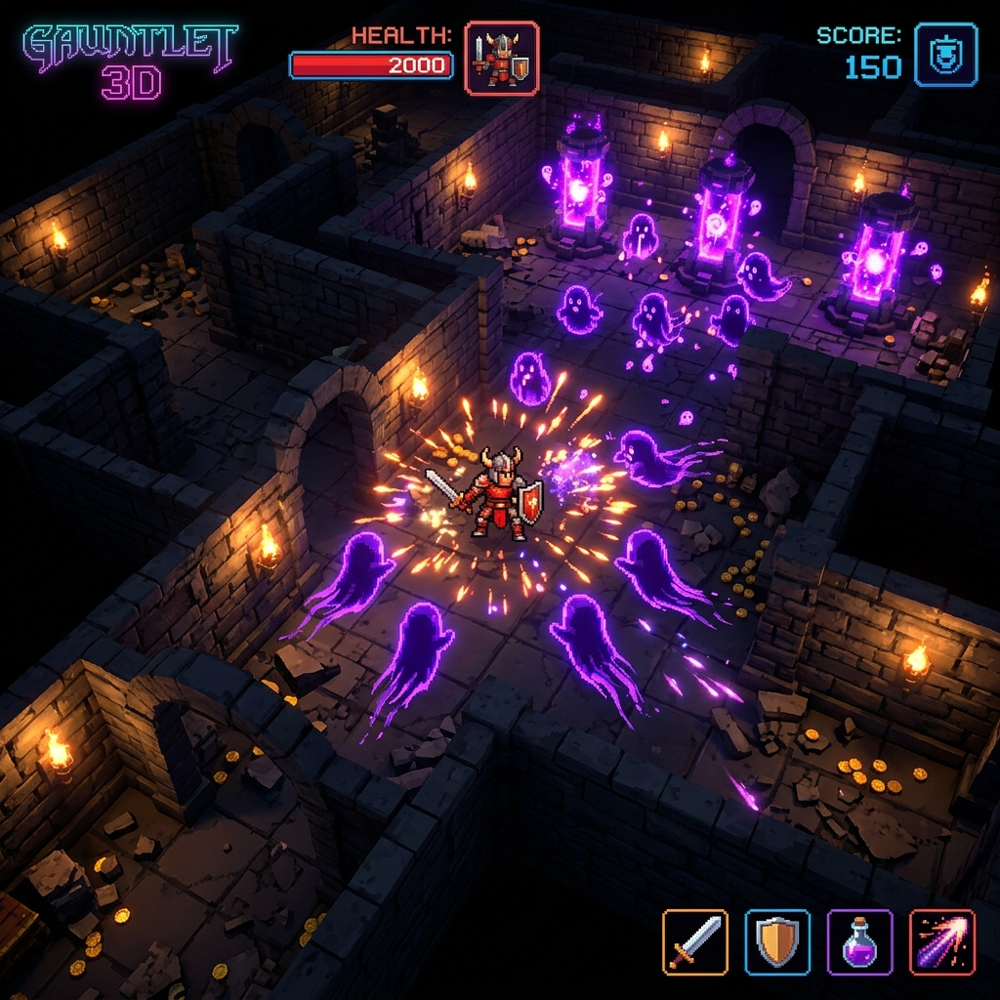
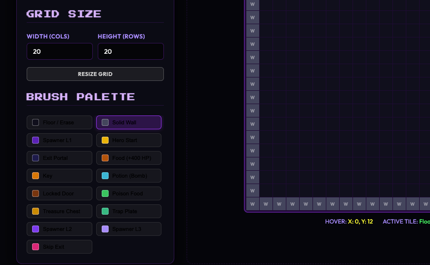

# 🛡️ Gauntlet 3D — Retro-Modern Dungeon Crawler

Welcome to **Gauntlet 3D**, a high-fidelity 3D top-down dungeon crawler inspired by the legendary 1985 arcade classic *Gauntlet*. Built with modern web technologies, this project blends a retro 8-bit aesthetic with modern WebGL capabilities, dynamic 3D physics, real-time speech narration, and a fully interactive Level and Texture Editor.

---

## 🎮 Screenshots

### 🖥️ Main Selection Menu


### ⚔️ In-Game 3D Gameplay


### 🛠️ Integrated Level & Texture Editor


---

## ✨ Features

- **Top-Down 3D Action**: Built on **Three.js** with realistic ambient lighting, smooth shadows (`THREE.PCFShadowMap`), and custom player torchlight/fog effects.
- **Dynamic Collision Physics**: Powered by **Cannon.js** with custom physical boundaries and collision filter masks to allow characters and projectiles to slide smoothly along walls without getting stuck.
- **Hero Classes**: Choose from four distinct heroes, each with unique attributes:
  - 🪓 **Warrior (Thor)**: Exceptional health and defense, standard melee speed.
  - 🧙‍♂️ **Wizard (Merlin)**: High magical attack and speed, lower defense.
  - 🛡️ **Valkyrie (Thyra)**: Ultimate armor protection and well-balanced stats.
  - 🏹 **Elf (Questor)**: Maximum movement speed, fast firing rate, lower health.
- **30 Unique Levels**: Procedurally generated and hand-crafted dungeon crawls featuring spawners, keys, locked doors, food, potion bomb pickups, chest treasures, and warp portals.
- **Atmospheric Audio & Speech**: Immersive arcade sound effects synthesized via Web Audio API, complemented by real-time synthesized voice narration warnings (e.g., *"Warrior is dead!," "Wizard is low on health"*).
- **Interactive Level Editor**: 
  - Design levels using a paint brush palette (Walls, Spawners, Hero starts, Keys, Doors, exits).
  - Change grid sizes dynamically (from `10x15` up to `50x50`).
  - Import/Export custom designs as JSON files, load presets, or copy the direct JavaScript array configuration.
  - Click **Playtest Level** to instantly deploy your design and play in the 3D sandbox.
- **Interactive Texture Editor**:
  - Draw custom pixel-art skins on a live interactive 2D canvas with nearest-neighbor rendering.
  - Add, change, and update hexadecimal color palettes.
  - Save assets directly to `localStorage` overrides, allowing custom skins (e.g., green lava walls or golden spawners) to render instantly inside the live game.

---

## 🚀 Running Locally

To run the game on your system:

### 1. Install Dependencies
Make sure you have [Node.js](https://nodejs.org/) installed, then run the following in the project's root folder:
```bash
npm install
```

### 2. Start the Development Server
Launch the local Vite server:
```bash
npm run dev
```
Open the browser at the address displayed in your console (typically `http://localhost:3000`).

### 3. Build for Production
To build the minified production assets under the `dist/` directory:
```bash
npm run build
```

---

## 🎹 Controls

- **Movement**: `W` `A` `S` `D` or `Arrow Keys`
- **Shoot Projectile**: `Left-Click` or `Spacebar` (shoots in the direction of movement/mouse pointer)
- **Use Potion (Screen Clear Bomb)**: `E` or `Shift` (consumes 1 potion to damage all surrounding enemies and spawners)
- **Unlock Doors**: Collide with locked doors if you have collected keys.
- **Escape Level**: Reach exit portals or warp portals to advance levels.

---

## 🛠️ Architecture Overview

- **`src/main.js`**: Orchestrates UI selection flows, restarts, HUD rendering, and launches the game loop.
- **`src/GameLoop.js`**: Core clock system stepping the physics world, updating positions, testing collision ranges, and managing WebGL renders.
- **`src/Hero.js`**: Player character definitions, stats, input tracking, health changes, and inventory items.
- **`src/Enemy.js`**: Handles entity behaviors for ghosts, **Death** (drains health and vanishes), and the **Thief** (steals items and attempts to flee).
- **`src/Spawner.js`**: Mob generators that spawn waves of ghosts unless destroyed.
- **`src/DungeonManager.js`**: Organizes 3D static block meshes, door activations, trap placements, and floats collectible objects.
- **`src/TextureGenerator.js`**: Renders and stores color mappings for characters, walls, and entities.
- **`src/editor.js`**: Front-end logic for painting levels and editing texture bitmaps.
